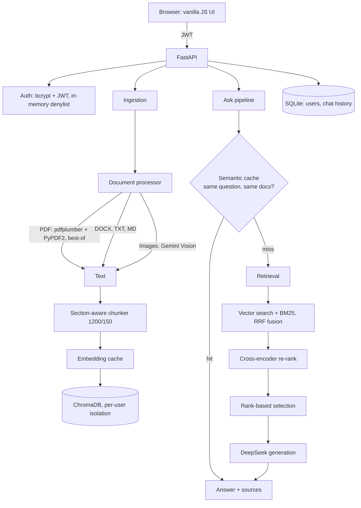

**"Doc-Chat — RAG over your documents, honestly measured"**

A retrieval-augmented chat app that answers questions **only** from the documents you upload — and refuses honestly when the answer isn't in them.

**Stack:** Python 3.11 · FastAPI · ChromaDB · sentence-transformers (`all-MiniLM-L6-v2`) · cross-encoder re-ranking (`ms-marco-MiniLM-L-6-v2`) · DeepSeek (`deepseek-chat`) for generation · Gemini Vision for image OCR · vanilla JS frontend (no build step) · SQLite for users and chat history.

---

## Why this one is different

Most RAG demos ask *"does it answer?"*. This one also asks *"does it refuse when it should — and can I prove it got better?"*

Three properties, each enforced in code:

1. **It abstains instead of guessing.** The prompt forbids outside knowledge, and every answer path returns exactly *"I couldn't find that in your documents."* when the retrieved context doesn't contain the answer. Measured at **100%** across 8 deliberately unanswerable questions.
2. **Every change is measured.** A 30-question golden set (22 answerable + 8 traps) scores Recall@k, MRR, correctness, faithfulness, abstain accuracy and latency, and saves a timestamped report per run so configurations can be compared side by side.
3. **Failures are honest.** If the LLM is unreachable the API returns `degraded: true` with a plain "service unavailable" message — it never passes document excerpts off as an answer. The evaluation excludes degraded responses from its metrics.

## Measured results

Every configuration below was run against the same golden set (`eval/golden_set.json`) through the same endpoint the UI uses. Raw reports: `eval/results/`.

| Config | Change | Recall@k | MRR | Correctness | Faithfulness | Abstain | False abstains |
|---|---|---|---|---|---|---|---|
| B | baseline (vector-only, no threshold tuning) | 0.909 | 0.909 | 0.909 | 1.000 | 1.000 | 2 / 22 |
| C | + hybrid BM25 search | 0.909 | 0.909 | 0.909 | 1.000 | 1.000 | 2 / 22 |
| D | + structure-aware chunking | 0.909 | 0.875 | 0.909 | 1.000 | 1.000 | 2 / 22 |
| E2 | + rank-based selection and honest failure path | **1.000** | 0.899 | **1.000** | **1.000** | **1.000** | **0 / 22** |

What the table actually taught us (kept honest on purpose):

- **Chunking and hybrid search alone did not move the headline number**, and a diagnostic tool (`scripts/debug_retrieval.py`) showed why: the original 500-character chunker produced 8-character shards such as `funding.` and chunks that mixed two unrelated sections, so the cross-encoder scored a chunk *containing the answer* at **-9.2** and it was thrown away.
- **The fix was coherence, not cleverness:** section-aware chunking (1200 chars / 150 overlap, with the section heading prepended to every chunk) plus **rank-based** selection, instead of an absolute cutoff applied to uncalibrated cross-encoder logits.
- **Hybrid search was re-enabled after real documents proved it.** On the clean synthetic set it tied with vector-only; on real documents (a photographed certificate plus a multi-page PDF) vector search missed a literal code ("A1") completely, which is exactly what BM25 keyword matching catches.
- **The golden set was too easy**, and real documents exposed four bugs a clean benchmark never would: corrupted PDF text extraction (`Unof ficial`, `Studen t name`), wrong-document retrieval, a prompt too strict to allow grounded inference, and `[object Object]` error messages in the UI. All four are fixed.

## Architecture



Data flow in words:

1. **Upload** → text extracted (PDF via pdfplumber/PyPDF2, best-quality of the two; images via Gemini Vision) → split at section and paragraph boundaries → embedded → stored in ChromaDB tagged with `user_id`.
2. **Ask** → semantic cache lookup (same user, unchanged document set, similarity ≥ 0.95) → otherwise vector + BM25 retrieval → RRF fusion → cross-encoder re-ranking → rank-based selection → generation with `[Source N]` citations.
3. **Honesty guard** → if nothing relevant is retrieved, or the context lacks the answer, the API returns the abstain sentence instead of guessing.

## Quick start (local)

```bash
# 1. Clone
git clone https://github.com/starislauz/doc-chat.git
cd doc-chat

# 2. Virtual environment
python -m venv venv
venv\Scripts\activate          # Windows
# source venv/bin/activate     # macOS / Linux

# 3. Dependencies
pip install -r backend/requirements.txt

# 4. Configuration: copy the template and add your keys
copy .env.example .env         # Windows (cp on macOS/Linux)
```

Then edit `.env` — the minimum you need is:

```env
DEEPSEEK_API_KEY=sk-...        # generation (required)
GEMINI_API_KEY=...             # image OCR only (optional but recommended)
LLM_PROVIDER=deepseek          # or "gemini"
SECRET_KEY=<a long random string>
```

```bash
# 5. Run
cd backend
python -m uvicorn app.main:app --host 0.0.0.0 --port 8000
```

Open **http://localhost:8000** — register an account, upload a document, ask a question.

> First start downloads the embedding and re-ranking models (~180 MB total) and the first request can take 10–30 seconds while they load into memory. After that, answers take ~4 seconds.

## Supported files and limits

| Type | Notes |
|---|---|
| PDF | Text PDFs preferred. Scanned/image PDFs are transcribed with Gemini Vision |
| DOCX | Paragraphs and tables |
| TXT / MD | UTF-8. Markdown headings produce the best chunks |
| PNG / JPG / BMP / TIFF (+ GIF/WebP via the image endpoint) | Gemini Vision reads text in images |

Limits: **3 documents per account**, 10 MB per document (5 MB per image), 5 files per upload request.

## Testing and evaluation

This is where the project earns its keep. Three tools, all run from the project root against a live server:

```bash
# Quality: 30-question golden set -> Recall@k, MRR, correctness, faithfulness,
# abstain accuracy, latency. Saves eval/results/run_<timestamp>.json + history.csv
python scripts/eval_rag.py --label "my config" --delay 2

# Abort if a build regresses
python scripts/check_extraction.py backend/uploads      # flags mid-word PDF splits
python scripts/debug_retrieval.py --question "..." --evidence "..."   # stage-by-stage retrieval
```

`eval/README.md` explains the harness; `eval/golden_set.json` is the question set; `eval/test_docs/` holds the documents it is scored against.

## Known limitations

Stated plainly, because hiding them would be dishonest:

- **The benchmark is small and clean.** 3 synthetic documents, 30 questions. A perfect score there does not mean perfect on messy real-world documents — real documents already exposed four bugs this set could not.
- **Chunking is structural, not semantic.** It splits at headings and paragraphs; it does not understand topic shifts within a long paragraph.
- **MRR is 0.899, not 1.000.** Answers are correct, but the best chunk sometimes ranks 3rd–5th, which costs context.
- **Every answer sends up to 5 chunks** — correct, but more tokens than strictly needed.
- **OCR quality depends on scan quality**, and image reading needs the Gemini key (DeepSeek has no vision).
- **Retrieval is English-focused.** `all-MiniLM-L6-v2` is a small English model; other languages will retrieve worse.
- **The relevance threshold is hand-tuned, not learned.**
- **Cold starts.** The models need ~1.5–2 GB of RAM, so an idle instance takes 10–30 seconds to warm up; most 512 MB free tiers will be killed outright.
- **Single process assumptions.** The semantic and embedding caches live in memory, so they are per-worker and reset on restart; logout revocation is likewise in-memory, not durable.
- **No rate limiting yet.** On a public deployment anyone who registers can consume your LLM credits — set a spending cap on your provider, or add a limit before sharing it widely.
- **Not verified:** real mobile devices, the upload modal on mobile, and behaviour under concurrent users.

## Deployment

See **[docs/DEPLOYMENT.md](docs/DEPLOYMENT.md)** for the free-hosting guide (which tiers actually work for a 2 GB model app, how to deploy to Hugging Face Spaces, and what to do about the missing persistent disk).

## Author

**Anthony Njoku** — AI/ML Engineer & MLOps Specialist

- GitHub: [starislauz](https://github.com/starislauz)
- LinkedIn: [anthony-emeka](https://www.linkedin.com/in/anthony-emeka-6227782a1/)
- Portfolio: [starislauz.github.io/myportfolio.com](https://starislauz.github.io/myportfolio.com/)

---

# Appendix — original feature notes and API reference

The sections below are the project's original notes, kept for reference: feature breakdown, REST API examples, project structure, multi-tenancy and troubleshooting.


- Upload up to **5 files at once** (PDFs, documents, images)
- Drag & drop interface with live preview
- Batch processing for multiple documents
- Individual file management

### 🖼️ **Image Support with OCR**
- Upload images: PNG, JPG, JPEG, BMP, TIFF
- Automatic text extraction using **Tesseract OCR**
- Perfect for:
  - 📸 Photos of handwritten notes
  - 📄 Scanned documents
  - 📊 Screenshots with text

### 🤖 **Document-only answering (no general knowledge)**
- **Grounded**: answers come from your uploaded documents, with `[Source N]` citations
- **Honest**: if the documents don't contain the answer it replies *"I couldn't find that in your documents."*
- **Reasoning allowed**: it may count, total, compare and conclude from the retrieved facts — but it never adds outside facts
- **No guessing**: no "helpful" filler, no invented numbers, dates or names

### 🔐 **Authentication & Security**
- JWT-based authentication with Bearer tokens
- User registration and login
- Multi-tenant data isolation
- Password hashing with bcrypt
- Upload enforcement (must upload before chatting)

### 📚 **Document Management**
- Upload PDF, DOCX, TXT, MD, and **image files**
- Automatic text extraction and chunking
- Vector embeddings with sentence-transformers
- ChromaDB for persistent storage (no Docker required)
- **Delete documents** with one click

### 🔍 **Advanced RAG**
- Semantic search using embeddings
- Top-K retrieval with relevance scoring
- Context-aware question answering with citations
- Chat history with sessions
- Query transformation and coreference resolution
- Re-ranking with cross-encoder models
- Streaming responses (SSE)

### 🎯 **Multimodal Support**
- Extract images from PDFs
- AI-generated image captions using Gemini Vision
- Search across text and images
- Standalone image upload

### ⚡ **Production Ready**
- Comprehensive error handling
- Request validation with Pydantic
- Logging and monitoring
- Health check endpoints
- CORS support
- Optional Redis caching

---

## 🚀 Quick Start

### Prerequisites

- **Python 3.8+** (Windows, macOS, or Linux)
- **Google Gemini API Key** - Get it from [Google AI Studio](https://makersuite.google.com/app/apikey)
- **Tesseract OCR (Optional)** - For better image text extraction
  - **Not required!** Images are read with Gemini Vision, which needs `GEMINI_API_KEY`. Install Tesseract only if you want local OCR
  - Windows: [Download installer](https://github.com/UB-Mannheim/tesseract/wiki)
  - Linux: `sudo apt-get install tesseract-ocr`
  - Mac: `brew install tesseract`

### Important Notes

⚠️ **Network Connectivity Required**
- Gemini API requires internet connection
- If you see network errors, see [NETWORK_TROUBLESHOOTING.md](NETWORK_TROUBLESHOOTING.md)
- Application has offline fallback mode for document search

✅ **Tesseract is Optional**
- Images work without Tesseract (uses Gemini Vision API)
- Install Tesseract for better local text extraction
- See [TESSERACT_SETUP.md](TESSERACT_SETUP.md) for details

### Installation

See **Quick start** above — it lists the exact commands for Windows, macOS and Linux.

> Older versions of this document described a `START_SERVER.bat` helper. That file is not part of the repository; the Quick start commands above are the supported path.

### Manual installation (alternative)

If you prefer manual setup:

```bash
# Create virtual environment
python -m venv venv

# Activate virtual environment
# On Windows:
venv\Scripts\activate
# On macOS/Linux:
source venv/bin/activate

# Install dependencies
pip install -r requirements.txt

# Create .env file
copy .env.example .env
# Edit .env and add your GEMINI_API_KEY

# Start server
cd backend
python -m uvicorn app.main:app --host 0.0.0.0 --port 8000 --reload
```

## API Documentation

Once the server is running, access the interactive API documentation:

- **Swagger UI**: http://localhost:8000/docs
- **ReDoc**: http://localhost:8000/redoc
- **Health Check**: http://localhost:8000/health

## API Endpoints

### Public Endpoints

| Method | Endpoint | Description |
|--------|----------|-------------|
| GET | `/` | Welcome message |
| GET | `/health` | Health check with service status |
| POST | `/register` | Create user account |
| POST | `/login` | Get JWT token |

### Protected Endpoints (Require Authentication)

**User Management**
| Method | Endpoint | Description |
|--------|----------|-------------|
| GET | `/me` | Get current user info |

**Document Management**
| Method | Endpoint | Description |
|--------|----------|-------------|
| POST | `/upload` | Upload document (PDF/TXT/MD) |
| POST | `/upload/multimodal` | Upload with image extraction |
| POST | `/upload/image` | Upload standalone image |
| GET | `/documents` | List user's documents |
| DELETE | `/documents/{id}` | Delete document |

**Question Answering**
| Method | Endpoint | Description |
|--------|----------|-------------|
| POST | `/ask` | Basic Q&A |
| POST | `/ask/enhanced` | Q&A with re-ranking and history |
| POST | `/ask/multimodal` | Q&A with text and images |
| POST | `/ask/stream` | Streaming Q&A responses |

**Chat Sessions**
| Method | Endpoint | Description |
|--------|----------|-------------|
| POST | `/chat/sessions` | Create chat session |
| GET | `/chat/sessions` | List user's sessions |
| GET | `/chat/sessions/{id}` | Get chat history |
| DELETE | `/chat/sessions/{id}` | Delete session |

**Images**
| Method | Endpoint | Description |
|--------|----------|-------------|
| GET | `/images/{doc_id}/{filename}` | Get image file |

## Usage Examples

### 1. Register and Login

```bash
# Register
curl -X POST "http://localhost:8000/register" \
  -H "Content-Type: application/json" \
  -d '{
    "username": "testuser",
    "email": "test@example.com",
    "password": "password123"
  }'

# Login
curl -X POST "http://localhost:8000/login" \
  -H "Content-Type: application/json" \
  -d '{
    "username": "testuser",
    "password": "password123"
  }'

# Save the access_token from the response
```

### 2. Upload Document

```bash
# Upload a PDF document
curl -X POST "http://localhost:8000/upload" \
  -H "Authorization: Bearer YOUR_TOKEN_HERE" \
  -F "file=@document.pdf"

# Upload with multimodal processing (extracts images)
curl -X POST "http://localhost:8000/upload/multimodal" \
  -H "Authorization: Bearer YOUR_TOKEN_HERE" \
  -F "file=@document.pdf"
```

### 3. Ask Questions

```bash
# Basic question
curl -X POST "http://localhost:8000/ask" \
  -H "Authorization: Bearer YOUR_TOKEN_HERE" \
  -H "Content-Type: application/json" \
  -d '{
    "question": "What is the main topic of the document?",
    "top_k": 5
  }'

# Enhanced question with re-ranking
curl -X POST "http://localhost:8000/ask/enhanced" \
  -H "Authorization: Bearer YOUR_TOKEN_HERE" \
  -H "Content-Type: application/json" \
  -d '{
    "question": "Explain the key findings",
    "session_id": "optional-session-id",
    "top_k": 5,
    "use_reranking": true
  }'
```

### 4. Python Client Example

```python
import requests

BASE_URL = "http://localhost:8000"

# 1. Register
response = requests.post(
    f"{BASE_URL}/register",
    json={
        "username": "testuser",
        "email": "test@example.com",
        "password": "password123"
    }
)
token = response.json()["access_token"]

# 2. Upload document
headers = {"Authorization": f"Bearer {token}"}
with open("document.pdf", "rb") as f:
    files = {"file": f}
    response = requests.post(
        f"{BASE_URL}/upload",
        headers=headers,
        files=files
    )
document_id = response.json()["id"]

# 3. Ask question
response = requests.post(
    f"{BASE_URL}/ask",
    headers=headers,
    json={
        "question": "What is this document about?",
        "top_k": 5
    }
)
answer = response.json()
print(f"Answer: {answer['answer']}")
print(f"Sources: {len(answer['sources'])}")
```

## Configuration

Edit `.env` file to customize settings:

```env
# Required - generation
DEEPSEEK_API_KEY=sk-...
LLM_PROVIDER=deepseek          # or "gemini"

# Optional - image OCR (Gemini Vision). Images are skipped without it.
GEMINI_API_KEY=...

# Security - use a long random string in production
SECRET_KEY=change-me
ACCESS_TOKEN_EXPIRE_MINUTES=10080   # 7 days

# Optional - Redis cache (the app works without it; an in-process cache is used)
REDIS_HOST=localhost
REDIS_PORT=6379
CACHE_ENABLED=true
```

### Configuration options

All settings live in `backend/app/config/settings.py` (or the matching environment variable):

- **Chunking**: `CHUNK_SIZE` (1200 chars), `CHUNK_OVERLAP` (150)
- **Embeddings**: `EMBEDDING_MODEL` (`all-MiniLM-L6-v2`)
- **Retrieval**: `DEFAULT_TOP_K` (5), `ENABLE_HYBRID_SEARCH` (vector + BM25),
  `RELEVANCE_THRESHOLD` (0.35 cosine, vector paths),
  `RERANK_THRESHOLD` (`null` = rank-based selection; cross-encoder scores are uncalibrated)
- **Generation**: `LLM_PROVIDER`, `DEEPSEEK_MODEL`, `GEMINI_MODEL`
- **Caching**: `SEMANTIC_CACHE_ENABLED`, `SEMANTIC_CACHE_THRESHOLD` (0.95), `SEMANTIC_CACHE_TTL`
- **Uploads**: max size, allowed types, `MAX_FILES_PER_UPLOAD`

## Project Structure

```
project/
├── backend/
│   ├── app/
│   │   ├── main.py                    # FastAPI app
│   │   ├── config/
│   │   │   └── settings.py            # Configuration
│   │   ├── models/
│   │   │   └── schemas.py             # Pydantic models
│   │   ├── services/
│   │   │   ├── document_processor.py  # Document processing
│   │   │   ├── vector_store.py        # ChromaDB operations
│   │   │   ├── llm_service.py         # Gemini API
│   │   │   ├── user_service.py        # User management
│   │   │   ├── chat_service.py        # Chat history
│   │   │   ├── rag_enhanced.py        # Re-ranking, relevance cutoff
│   │   │   ├── cache_service.py       # Semantic answer cache
│   │   │   └── image_processor.py     # Image processing
│   │   └── utils/
│   │       ├── auth.py                # JWT authentication
│   │       ├── file_handler.py        # File operations
│   │       └── logging_config.py      # Logging setup
│   ├── chroma_db/                     # Vector database (created automatically)
│   ├── users.db                       # User database (created automatically)
│   └── chat_history.db                # Chat database (created automatically)
├── uploads/                           # Uploaded files (created automatically)
├── images/                            # Extracted images (created automatically)
├── eval/                              # 30-question golden set, test docs, results
├── scripts/                           # eval_rag.py, check_extraction.py, debug_retrieval.py
├── docs/                              # DESIGN.md, DEPLOYMENT.md
├── requirements.txt                   # Python dependencies (backend/requirements.txt)
├── .env                               # Configuration (create from .env.example)
└── README.md                          # This file
```

## Architecture

### Data Flow

1. **Document Upload**
   - User uploads PDF/TXT/MD file
   - Text extracted and split into chunks
   - Chunks embedded using sentence-transformers
   - Stored in ChromaDB with user_id for isolation

2. **Question Answering**
   - User asks question
   - Question embedded and compared to stored chunks
   - Top-K most relevant chunks retrieved
   - Gemini generates answer using context
   - Answer returned with source citations

3. **Chat History**
   - Chat sessions stored in SQLite
   - Previous messages used for context
   - Query transformation resolves references

### Multi-Tenancy

All data is isolated by `user_id`:
- Documents in ChromaDB filtered by user_id
- Files stored in user-specific directories
- Chat sessions linked to user accounts
- Images accessible only to owners

### Security

- Passwords hashed with bcrypt
- JWT tokens for authentication
- Bearer token required for protected endpoints
- User ownership validated on all operations
- File size and type validation
- SQL injection prevention (parameterized queries)

## Troubleshooting

### Common Issues

**1. Network Error: `[Errno 11001] getaddrinfo failed`**
- **Cause:** Cannot connect to Google's Gemini API
- **Solutions:**
  - Check internet connection
  - Check firewall settings
  - Configure proxy if behind corporate network
  - The app retries automatically, then reports the outage honestly instead of inventing an answer

**2. Image Upload Error: "tesseract is not installed"**
- **No worries!** Tesseract is optional
- **Application uses Gemini Vision as fallback** (works without Tesseract)
- **To install Tesseract:** See [TESSERACT_SETUP.md](TESSERACT_SETUP.md)
- **With Tesseract:** Better local text extraction from images
- **Without Tesseract:** Images still work via Gemini Vision API

**3. "Gemini API key not found"**
- Edit `.env` file and add your API key
- Get key from https://makersuite.google.com/app/apikey
- Restart the server after editing .env

**4. "Module not found" errors**
- Activate virtual environment: `venv\Scripts\activate`
- Install dependencies: `pip install -r requirements.txt`

**5. ChromaDB errors**
- Delete `backend/chroma_db` folder and restart
- System will recreate the database

**6. Port 8000 already in use**
- Stop other processes using port 8000
- Or change port: `uvicorn app.main:app --port 8001`

**7. Slow first question**
- First question loads embedding models (normal)
- Subsequent questions will be faster
- Models are cached after first load

### Detailed Troubleshooting Guides

📘 **[NETWORK_TROUBLESHOOTING.md](NETWORK_TROUBLESHOOTING.md)** - Fix connection errors
- DNS resolution issues
- Firewall configuration
- Proxy setup
- VPN issues
- Offline fallback mode

📘 **[TESSERACT_SETUP.md](TESSERACT_SETUP.md)** - Install OCR (optional)
- Windows installation
- PATH configuration
- Verification steps
- Gemini Vision fallback

### Application Behavior

**With Network Connection:**
- ✅ Full AI-powered responses
- ✅ Image captioning with Gemini Vision
- ✅ Smart document-based answers

**Without Network Connection:**
- ✅ Document upload (without image AI)
- ✅ Document search (vector search works)
- ✅ Document excerpts shown
- ❌ No AI-generated responses (offline fallback provided)

**With Tesseract:**
- ✅ Fast local OCR for images
- ✅ Works offline for text extraction

**Without Tesseract:**
- ✅ Images still work (Gemini Vision)
- ❌ Requires internet for image processing

### Logs

- Check console output for detailed logs
- Errors include specific messages
- Log level: INFO (production), DEBUG (development)

## Performance

- **Document Upload**: < 10 seconds for 10-page PDF
- **Question Answering**: < 3 seconds (after model loading)
- **First Query**: May take 10-30 seconds (loads models)
- **Embeddings**: Batch processed for efficiency
- **Caching**: Optional Redis for frequently asked questions

## Technologies

- **FastAPI** - Modern Python web framework
- **ChromaDB** - Vector database (local, no Docker)
- **sentence-transformers** - Text embeddings
- **Google Gemini** - Large language model
- **SQLite** - User and chat storage
- **PyPDF2** - PDF processing
- **Pillow** - Image handling
- **JWT** - Authentication tokens
- **bcrypt** - Password hashing

## License

This project is provided as-is for educational and commercial use.

## Support

For issues or questions:
1. Check the troubleshooting section above
2. Review logs for error details
3. Verify API key is set correctly
4. Ensure all dependencies are installed

## Roadmap

Potential future enhancements:
- [ ] Multiple LLM providers (OpenAI, Anthropic)
- [ ] Advanced document types (DOCX, Excel)
- [ ] Batch document upload
- [ ] Document versioning
- [ ] User groups and sharing
- [ ] Custom embeddings fine-tuning
- [ ] Web UI frontend

---

**Built with ❤️ using FastAPI, ChromaDB, and Google Gemini**
