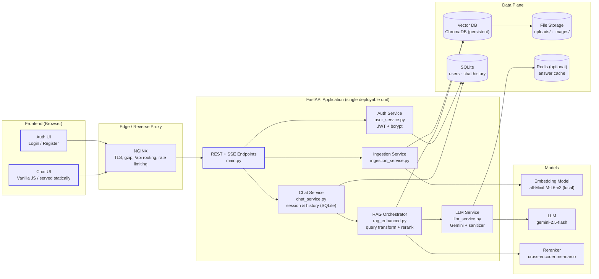
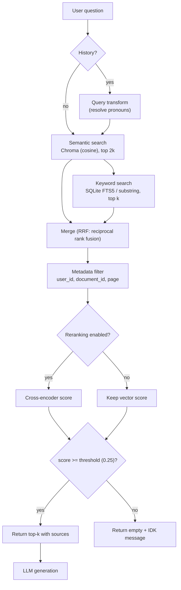
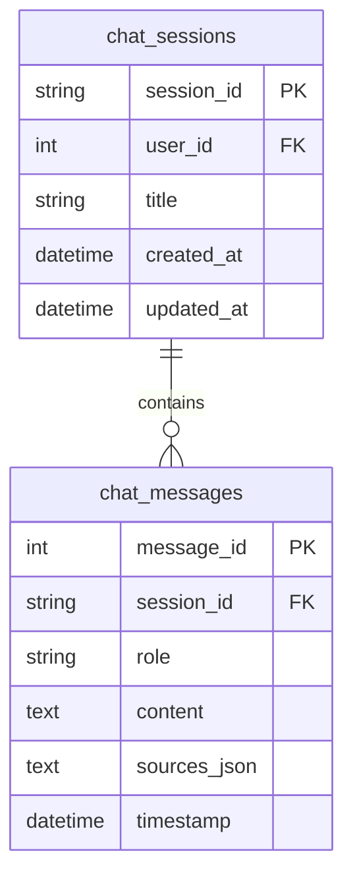
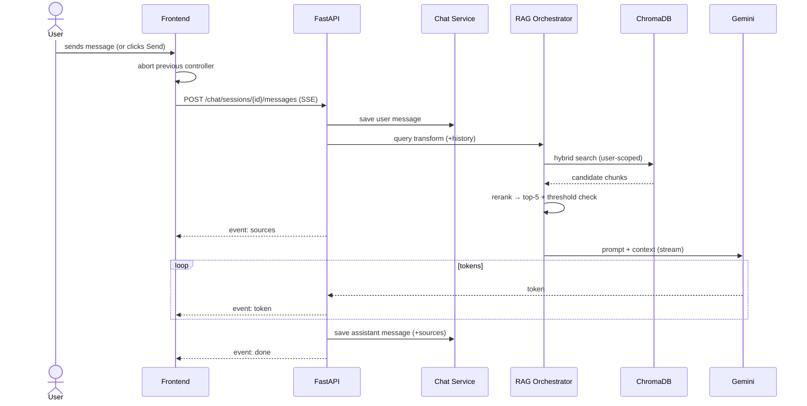
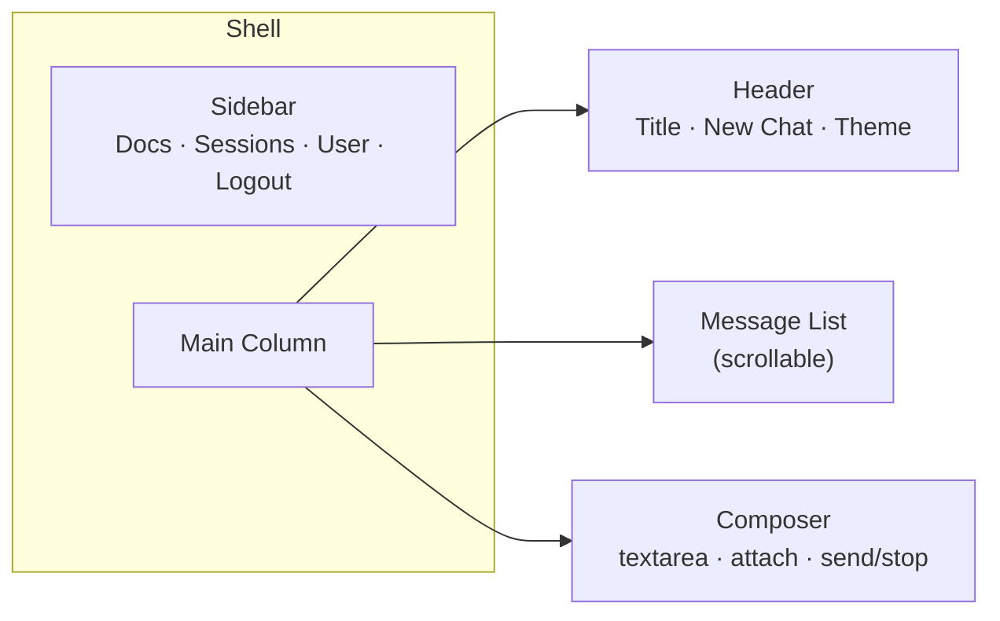
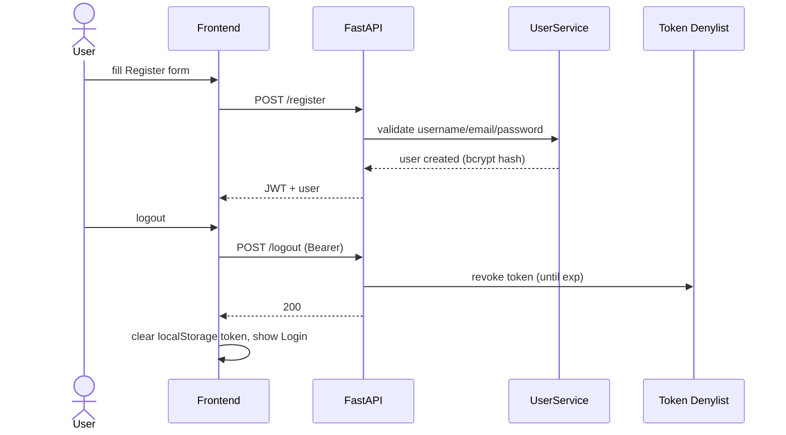

# RAG Document Chat — System Design Document

| | |
|---|---|
| **Product** | RAG Document Chat (AI-Powered Document Assistant) |
| **Version** | 2.0 |
| **Status** | Production-grade specification |
| **Stack in use** | FastAPI · ChromaDB · Sentence-Transformers · Google Gemini · SQLite · Vanilla JS |

---

## 0. Goals & Non-Negotiable Design Principles

1. **Professional output.** The AI must never emit raw markdown headings (`#`, `##`, `###`) in chat answers. This is enforced in three layers: prompt rules → backend sanitizer → frontend renderer. See [§4.6](#46-professional-response-formatting).
2. **Standard, secure authentication.** Register → Login → Logout is a first-class, hardened flow (JWT + bcrypt + token revocation). See [§7.3](#73-authentication--access-control).
3. **Clean, calm UI.** One accent color, neutral surfaces, no competing gradients, no decorative animations that cause jank. See [§6.1](#61-design-system).
4. **Single-response rule.** One session = at most one streaming response at any time. Never two parallel responses for the same session. See [§4.3](#43-single-response-rule).
5. **Separation of ingestion and serving.** Ingestion is a pipeline; chat is a request path. They share the vector store but never block each other. See [§1.2](#12-separation-of-concerns).

---

## 1. System Architecture



### 1.1 Component Responsibilities

| Component | Responsibility | Must NOT do |
|---|---|---|
| Frontend | Render chat, stream tokens, cancel requests, hold JWT | Never decide retrieval logic |
| NGINX | TLS termination, static assets, `/api` proxy, burst limiting | No business logic |
| FastAPI | Auth, REST, SSE streaming, orchestration | No blocking work in the event loop (LLM/embedding calls run via `run_in_executor` / async clients) |
| Chat Service | Sessions, message persistence, history windowing | No retrieval math |
| RAG Orchestrator | Query transformation, hybrid search merge, reranking | No persistence |
| LLM Service | Prompt building, Gemini calls, answer sanitization, caching | No user data decisions |
| Ingestion Service | Parse → clean → chunk → embed → store; job tracking | Never run synchronously inside the chat request path |
| ChromaDB | Vector similarity + metadata filtering | Only store embeddings; source of truth for docs is file storage + jobs table |

### 1.2 Separation of Concerns: Ingestion vs. Serving

**Ingestion (write path)** is heavy, slow, and bursty (seconds per document).

- Runs as an async background job (`ingestion_service`), with job status polling via `GET /ingestion/{job_id}`.
- Owns its own resources: parser process, embedding batches, DB writes.
- Rate-limited per user (document cap) and protected against concurrent uploads of the same file.

**Serving (read path)** is latency-critical (first token < 1–2 s).

- Only does: query transform → vector search → rerank → LLM stream.
- Never waits on ingestion. A document that is still being ingested is simply not yet searchable.

They share **only** the Chroma collection. Ingestion failure never degrades serving; a slow upload never stalls chat.

### 1.3 Recommended Tech Stack (with justification)

| Layer | Choice | Why |
|---|---|---|
| Frontend | **Vanilla HTML/CSS/JS** (current) | Zero build step, zero framework overhead, loads instantly, no dependency churn — matches the "classic, simple, never hangs" requirement. *Future option:* Next.js when teams/scaling demand it — the API contract below is framework-agnostic. |
| Backend | **FastAPI** (Python) | Async-native SSE streaming, Pydantic validation, auto OpenAPI docs, matches the ML ecosystem (sentence-transformers, Chroma) without polyglot glue. |
| Vector DB | **ChromaDB** (persistent client) | Single-node, embedded, no extra service to operate; cosine space via HNSW; metadata `where` filters give per-user isolation. *Scale path:* Qdrant/pgvector behind the same `VectorStore` interface. |
| Embeddings | **sentence-transformers `all-MiniLM-L6-v2`** | 384-dim, strong quality/speed ratio, runs locally (no API cost, no PII leaving the box). *Scale path:* OpenAI/Cohere embeddings via env flag. |
| LLM | **Google Gemini (`gemini-2.5-flash`)** | Fast streaming, large context, cheap; already integrated with retry/backoff and offline fallback. |
| Reranker | **cross-encoder `ms-marco-MiniLM-L-6-v2`** (optional toggle) | Cheap local cross-encoder that meaningfully lifts precision of top-k. |
| Metadata DB | **SQLite** (users, chat history, jobs) | Zero-ops for single-node deployment; WAL mode. *Scale path:* Postgres. |
| Cache | **Redis (optional)** | Answer cache for repeated questions; system degrades gracefully without it. |
| Auth | **JWT (`python-jose`) + bcrypt** | Stateless API auth with 7-day access tokens + server-side revocation list (see §7.3). |
| Proxy | **NGINX** | TLS, static file serving, `/api` routing, request buffering off, rate limiting. |

---

## 2. Document Ingestion Pipeline

```mermaid
sequenceDiagram
    actor U as User
    participant FE as Frontend
    participant API as FastAPI /upload
    participant ING as Ingestion Service
    participant PAR as Parser (PDF/DOCX/TXT/Image OCR)
    participant EMB as Embedding Model
    participant VEC as ChromaDB
    participant JOB as Jobs DB (SQLite)

    U->>FE: Choose file(s)
    FE->>API: POST /upload (multipart, JWT)
    API->>API: Validate size/type/limits
    API->>ING: enqueue job
    API-->>FE: 202 { job_id, status: queued }
    ING->>PAR: extract text per page
    PAR-->>ING: raw text + page map
    ING->>ING: clean (whitespace, artifacts, encoding)
    ING->>ING: chunk (500 chars / 50 overlap)
    ING->>EMB: embed batch
    EMB-->>ING: vectors
    ING->>VEC: add(ids, embeddings, docs, metadata)
    ING->>JOB: update progress
    ING-->>FE: (poll) GET /ingestion/{job_id} -> completed
```

### 2.1 Stage-by-stage

| Stage | Action | Details |
|---|---|---|
| 1. Upload | `POST /upload` | Multipart, ≤ 5 files, ≤ 10 MB each; type whitelist (pdf, docx, txt, md, images); stored under `uploads/{user_id}/` |
| 2. Parsing | `document_processor` | PDF via pypdf/pdfplumber with page numbers; DOCX via python-docx; images via OCR + Gemini vision captioning |
| 3. Cleaning | Normalization | Collapse whitespace, strip control chars, drop header/footer noise, de-duplicate blank pages |
| 4. Chunking | Sliding window | **`chunk_size = 500` chars, `chunk_overlap = 50`** |
| 5. Embedding | `all-MiniLM-L6-v2` | Batched encode; vectors stored in Chroma with cosine distance |
| 6. Store | `vector_store.add_document` | One Chroma record per chunk + metadata |

### 2.2 Why 500 / 50 chunking?

- **500 chars ≈ 120–150 tokens**: small enough that one chunk is a precise citation unit and fits comfortably in prompt context; large enough to carry a complete idea/paragraph.
- **50 (10%) overlap**: preserves sentences cut at boundaries, so an answer spanning two adjacent chunks is never split mid-thought.
- Tuning rule: if evaluation (§7.1) shows recall loss on definitions, raise overlap to 100; if retrieval becomes noisy, lower to 25.

### 2.3 Chunk Metadata (every record)

```json
{
  "document_id": "uuid",
  "document_name": "report.pdf",
  "user_id": "42",
  "chunk_index": 7,
  "page_number": 3,
  "file_type": ".pdf",
  "file_size": 1048576,
  "created_at": "2026-08-17T10:00:00Z",
  "summary": "optional AI summary",
  "full_text_length": 12000
}
```

### 2.4 Re-embedding, Updates, and Deletions

| Event | Action |
|---|---|
| **New file** | Full pipeline. |
| **Same file re-uploaded** | Delete all chunks `where document_id = X AND user_id = Y`, then re-ingest (re-embed, because embedding config or model version may have changed). |
| **Model / chunking config change** | Re-embedding is required for **all** documents. Bump a `pipeline_version` field; a background job re-ingests docs where `pipeline_version < current`. |
| **Delete document** | `DELETE /documents/{id}` → remove chunks by document_id + user_id, delete `images/{user_id}/{doc_id}/`, delete source file. Hard delete, no tombstones. |
| **User logout cleanup** | Optional storage policy: `POST /cleanup/user` removes that user's vectors + files (current behavior). |

---

## 3. Retrieval Strategy



### 3.1 Hybrid Search

1. **Semantic (Chroma):** cosine similarity over embeddings, `n_results = top_k * 2` when reranking, filtered by `user_id`.
2. **Keyword (BM25-like):** maintain an **SQLite FTS5** table of chunks (`document_id, chunk_index, text`) populated at ingestion. Lexical terms ("invoice #1234", SKU codes, names) that embeddings miss are caught here.
3. **Fusion:** Reciprocal Rank Fusion — `score(c) = Σ 1/(60 + rank_i)` over both result lists. Deterministic, no score calibration needed.

> *Current state:* semantic-only. FTS5 table is the next increment; the retrieval interface already isolates this change behind `vector_store.search()`.

### 3.2 Reranking & top-k

- Candidate pool: `top_k * 2` (default 10) → cross-encoder (`ms-marco-MiniLM-L-6-v2`) scores `(question, chunk)` pairs → take best `top_k = 5`.
- Cross-encoder latency is ~ms per pair on CPU — cheap enough to always run for k ≤ 10; feature flag `enable_reranking` (currently default-off for speed) keeps it optional.
- **Why 5?** 3 is sometimes too little to answer compound questions; 10 floods the prompt and dilutes attention. 5 balances coverage vs. focus, and keeps sources displayable.

### 3.3 Metadata Filtering & Relevance Threshold

- **Mandatory filter:** `user_id` on every query — hard tenant isolation.
- **Optional filters:** `document_id`, `page_number`, `file_type`.
- **Threshold:** default relevance cutoff `0.25` after normalization. Below it:

```
"I couldn't find anything in your documents that answers this question.
Try rephrasing, or ask about a different aspect."
```

This is the only case the system says "I don't know" — and it says it politely, professionally, with a suggested next action. The frontend shows this as a normal assistant message with **no** source chips.

---

## 4. Chat & Conversation Engine

### 4.1 Session & Message History



- Persisted in SQLite (`chat_history.db`), WAL mode, indexed on `(user_id)` and `(session_id)`.
- Every `user` message is saved **before** streaming starts; every `assistant` message is saved **after** the stream completes (atomic: if cancelled mid-stream, we persist the partial text and mark it `stopped`).
- History sent to the LLM: **last 5 exchanges**, each as `{role, content}`. Sources are not replayed to the LLM, only stored for display.

### 4.2 Context Window Management

Budget: Gemini 2.5 Flash has a ~1M-token window; we deliberately cap our usage.

| Layer | Strategy |
|---|---|
| 1. Hard cap | Last **5** messages + retrieved chunks (≤ 5 × 150 tokens ≈ 750) + prompt (~500) — total ≪ model limit |
| 2. Truncation | Each history message truncated to 2,000 chars; chunks never truncated (they are the evidence) |
| 3. Summarization | When a session exceeds 20 messages, the first N messages are compressed into a single `<summary>` block (generated by a cheap LLM call at idle time) and stored in a `session_summaries` table |
| 4. Fresh session | "New Chat" button creates a new `session_id` — history reset is explicit, never implicit |

### 4.3 SINGLE-RESPONSE RULE (Very Important)

> **Invariant:** for any `(user_id, session_id)` pair, at most **one** generation is in flight. A new message or an explicit stop **always** terminates the previous generation before a new one begins.

#### a) Frontend — AbortController cancels the previous request

```js
let activeController = null;   // one per chat session

async function sendMessage() {
  // 1) Immediately cancel any in-flight request
  if (activeController) activeController.abort();

  const controller = new AbortController();
  activeController = controller;

  try {
    const res = await fetch(`${API_BASE_URL}/chat/sessions/${sessionId}/messages`, {
      method: 'POST',
      headers: { 'Content-Type': 'application/json', Authorization: `Bearer ${token}` },
      body: JSON.stringify({ question }),
      signal: controller.signal          // <-- cancellation hook
    });
    await streamSSE(res, controller);    // read token/sources/done/error events
  } catch (err) {
    if (err.name === 'AbortError') markMessageStopped();
    else showError(err);
  } finally {
    if (activeController === controller) activeController = null;
  }
}
```

#### b) Backend — cancellation-aware streaming + session lock

```python
# main.py (design sketch — matches existing services)
from fastapi import Request
import asyncio, json

active_generations = {}          # (user_id, session_id) -> generation_id
_locks = defaultdict(asyncio.Lock)   # session locks

@app.post("/chat/sessions/{session_id}/messages")
async def send_message_stream(session_id: str, request: QuestionRequest, req: Request,
                              user_id: int = Depends(get_current_user_id)):
    lock = _locks[(user_id, session_id)]

    async with lock:                     # (c) mutex: no parallel responses
        gen_id = str(uuid.uuid4())
        active_generations[(user_id, session_id)] = gen_id

        try:
            chat_service.add_message(session_id, "user", request.question)

            async def event_stream():
                # retrieve + rerank (existing rag_enhanced path)
                results = retrieve(...)
                yield sse({"type": "sources", "sources": [...]})

                full_text = ""
                try:
                    for chunk in llm_service.generate_answer_stream(...):
                        if await req.is_disconnected():          # client went away
                            break
                        if gen_id != active_generations.get((user_id, session_id)):
                            break                                # superseded by a newer message
                        full_text += chunk
                        yield sse({"type": "token", "text": chunk})
                finally:
                    # persist even partial output, then free the lock
                    chat_service.add_message(session_id, "assistant", full_text,
                                             stopped=(gen_id != active_generations.get(...)))
                    active_generations.pop((user_id, session_id), None)
                    yield sse({"type": "done"})

            return StreamingResponse(event_stream(), media_type="text/event-stream")

        except Exception as e:
            yield sse({"type": "error", "message": str(e)})
```

Key mechanics:

- **Lock:** `asyncio.Lock` per session → the new request *waits* for the old generator's `finally` to release it (never > a few ms after abort). Two responses can never run for the same session.
- **Supersede:** the new message bumps `active_generations[..]` to a fresh `gen_id`; the old generator notices its id no longer matches and stops yielding, which closes the stream, which triggers `finally`.
- **Client disconnect:** `await req.is_disconnected()` catches page close and `AbortController.abort()`.
- **Partial persistence:** whatever was generated before cancellation is saved with `stopped: true` so history stays truthful.

#### c) New message while streaming

```
User types message #2 while response #1 is streaming
  → frontend calls abort() on controller #1
  → browser closes fetch #1 (FIN/RST to server)
  → server: req.is_disconnected() = True → generator breaks → finally persists partial #1, releases lock
  → server: request #2 acquires lock → new gen_id → starts streaming response #2
  → frontend: message #1 bubble shows "Stopped" state, message #2 bubble starts streaming
```

#### d) Stop button (backend endpoint)

```
POST /chat/sessions/{session_id}/stop
Authorization: Bearer <jwt>

→ bumps active_generations[(user, session)] to "STOPPED" marker
→ generator observes mismatch → stops → emits {"type": "done", "stopped": true}
→ frontend (optional; its AbortController also aborts fetch)
```

The UI Stop button simply calls this endpoint **and** aborts the local fetch — belt and suspenders.

### 4.4 Streaming Protocol (SSE)

`POST /chat/sessions/{session_id}/messages` returns `text/event-stream`. Event types:

| Event | Payload | Meaning |
|---|---|---|
| `sources` | `{type, sources:[{document_id, document_name, chunk_text, relevance_score, page_number}]}` | Sent once before tokens; frontend renders citation chips immediately |
| `token` | `{type, text:"..."}` | Delta text; append to current bubble |
| `done` | `{type, stopped?: boolean}` | Stream finished (or was stopped); persist bubble |
| `error` | `{type, message}` | Generation error; render error state |

```text
data: {"type":"sources","sources":[{"document_name":"report.pdf","chunk_text":"...","relevance_score":0.82}]}

data: {"type":"token","text":"The report covers three areas."}

data: {"type":"token","text":" First, ..."}

data: {"type":"done"}
```

Frontend reader:

```js
async function streamSSE(res, controller) {
  const reader = res.body.getReader();
  const decoder = new TextDecoder();
  let buffer = '';
  while (true) {
    const { value, done } = await reader.read();
    if (done) break;
    buffer += decoder.decode(value, { stream: true });
    let idx;
    while ((idx = buffer.indexOf('\n\n')) !== -1) {
      const line = buffer.slice(0, idx).trim(); buffer = buffer.slice(idx + 2);
      if (!line.startsWith('data:')) continue;
      const evt = JSON.parse(line.slice(5).trim());
      handleEvent(evt);                      // sources → chips, token → append, done/error → finalize
    }
  }
}
```

### 4.5 Conversation Flow (end-to-end)



### 4.6 Professional Response Formatting

**Problem:** model sometimes answers with `### Your Journey with Supervised Learning...`. Raw markdown headings look unprofessional in a chat bubble.

**Fix — three layers:**

1. **Prompt rule** (in `_build_prompt`):

```
FORMATTING RULES (mandatory):
- Never use markdown headings (#, ##, ###, ####).
- Start directly with the answer.
- Use plain paragraphs, short bullet lists (-), and bold (**text**) for emphasis only.
```

2. **Backend sanitizer** (applied to non-stream and stream output):

```python
import re
_HEADING_RE = re.compile(r'^\s{0,3}#{1,6}\s*', re.MULTILINE)

def sanitize_answer(text: str) -> str:
    """Strip leading # marks from every line so no ### ever reaches the UI."""
    return _HEADING_RE.sub('', text)
```

Streaming applies it line-buffered so a heading split across chunks is still caught.

3. **Frontend renderer** (`formatMessageText`) — final defense: strips any surviving `#{1,6}` prefix and renders `**bold**`, `*italic*`, `-` lists, newlines.

Result: `### Your Journey...` renders as `Your Journey...` (bold, heading-free) — clean and professional.

---

## 5. API Specification

Base URL: `/` in dev, `/api` behind NGINX. All protected routes require `Authorization: Bearer <jwt>`.

### 5.1 Auth

| Method | Path | Body | Response | Notes |
|---|---|---|---|---|
| `POST` | `/register` | `{username, email, password}` | `{access_token, token_type, user}` | 400 on duplicate/weak password |
| `POST` | `/login` | `{username, password}` | `{access_token, token_type, user}` | 401 generic message (no user enumeration) |
| `POST` | `/logout` | — | `{message}` | Revokes token via denylist |
| `GET` | `/me` | — | `User` | Token validation + freshness check |

### 5.2 Documents

| Method | Path | Purpose |
|---|---|---|
| `POST` | `/upload` | Multipart, ≤5 files; returns `[{id, filename, chunk_count, ...}]` |
| `GET` | `/documents` | List user documents with summaries |
| `GET` | `/documents/{id}` | Document details |
| `DELETE` | `/documents/{id}` | Delete chunks + files |
| `GET` | `/ingestion/{job_id}` | Job status (queued/progress/completed) |

### 5.3 Chat

| Method | Path | Purpose |
|---|---|---|
| `POST` | `/chat/sessions` | Create session `{title}` → `ChatSession` |
| `GET` | `/chat/sessions` | List user sessions (newest first) |
| `GET` | `/chat/sessions/{id}` | Full message history (with sources) |
| `DELETE` | `/chat/sessions/{id}` | Delete session + messages |
| `POST` | `/chat/sessions/{id}/messages` | **Streaming** send (SSE: sources/token/done/error) |
| `POST` | `/chat/sessions/{id}/stop` | Stop active generation |

#### Example — send message (streaming)

Request:
```http
POST /chat/sessions/abc-123/messages
Authorization: Bearer eyJhbGciOi...
Content-Type: application/json

{ "question": "What does the report say about Q3 revenue?" }
```

Response (SSE):
```text
data: {"type":"sources","sources":[{"document_id":"d1","document_name":"report.pdf","chunk_text":"Q3 revenue grew 12%...","relevance_score":0.81,"page_number":4}]}

data: {"type":"token","text":"The report states that "}

data: {"type":"token","text":"Q3 revenue grew 12% year-over-year."}

data: {"type":"done"}
```

#### Example — history

```json
[
  {
    "message_id": 10,
    "session_id": "abc-123",
    "role": "user",
    "content": "What does the report say about Q3 revenue?",
    "timestamp": "2026-08-17T10:00:01Z",
    "sources": null
  },
  {
    "message_id": 11,
    "session_id": "abc-123",
    "role": "assistant",
    "content": "The report states that Q3 revenue grew 12% year-over-year.",
    "timestamp": "2026-08-17T10:00:04Z",
    "sources": [ { "document_id": "d1", "document_name": "report.pdf", "chunk_text": "Q3 revenue...", "relevance_score": 0.81, "page_number": 4 } ]
  }
]
```

### 5.4 Error Codes

| HTTP | Meaning | Example detail |
|---|---|---|
| `400` | Validation / business rule | `"Username already exists"`, `"Document limit reached"` |
| `401` | Missing/invalid/revoked token | `"Invalid authentication credentials"` |
| `404` | Resource not found / not owned | `"Chat session not found"` |
| `413` | Payload too large | file > 10 MB |
| `422` | Schema validation | malformed JSON body |
| `429` | Rate limited | `"Too many requests. Try again in 30s."` |
| `500` | Internal error | generic, logged server-side |

### 5.5 Rate Limiting

- **Auth endpoints:** 10 req/min/IP (brute-force protection).
- **Chat:** 20 req/min/user; concurrency 1 active stream/session (the lock).
- **Upload:** 10 uploads/hour/user + hard document cap (3) + size cap (10 MB).
- Implementation: NGINX `limit_req` for coarse IP limits + a lightweight in-app token bucket per user for chat.

---

## 6. Frontend Behavior

### 6.1 Design System (the "no color fight" rule)

| Token | Dark | Light |
|---|---|---|
| Background | `#0f1117` | `#f4f6fa` |
| Surface | `#181c26` | `#ffffff` |
| Surface raised | `#1f2430` | `#eef1f6` |
| **Accent (only one)** | `#5b6cff` | `#4f46e5` |
| Text primary | `#e6e9f0` | `#111827` |
| Text secondary | `#9aa3b5` | `#4b5563` |
| Border | `rgba(148,163,184,.14)` | `rgba(15,23,42,.1)` |
| Danger / Success / Warning | functional only | functional only |

**Rules:**
- One accent hue (indigo). No pink/teal/green gradient rainbows, no animated background gradients, no floating particles, no bouncy icons.
- Motion ≤ 200 ms, only for fade/slide of messages, streaming cursor, and skeleton loaders. Everything else is instant.
- Emojis: none in headings/UI copy; icons come from Font Awesome only.

### 6.2 Layout



- **Sidebar:** document list (searchable), session history (switchable), user block (name/email) + Logout.
- **Composer:** auto-growing textarea; `Enter` sends, `Shift+Enter` newline. While streaming, Send is replaced by a red **Stop** button.

### 6.3 Streaming & Cancellation Visuals

| State | Visual |
|---|---|
| User sends while previous response streaming | Previous bubble finishes with a muted **"Stopped"** tag + timestamp; new bubble appears immediately with blinking cursor |
| Streaming | Cursor `▍` blinking at text end; Stop button visible; input disabled? No — input stays enabled, typing again = cancel again |
| Stop clicked | Same as cancel: "Stopped" tag; Stop button reverts to Send |
| Sources arrived | Citation chips appear **under the bubble** at the moment `sources` event arrives |
| Done | Cursor removed; timestamp added; actions row (read aloud, copy) appears |

### 6.4 Sources / Citations

Under every answer with sources:

```
┌ Sources ─────────────────────────────────────────┐
│ 📄 report.pdf — page 4 · relevance 81%          │
│    "Q3 revenue grew 12% year-over-year..."      │
└──────────────────────────────────────────────────┘
```

Each chip links to the document (future: `GET /documents/{id}/view`). Chunk text shows the first ~150 chars. No sources → no chips, and the answer must have been threshold-gated (§3.3).

### 6.5 Loading, Empty & Error States

| State | UI |
|---|---|
| Loading (initial) | Skeleton lines in message list |
| No documents | Calm empty state: icon + "Upload a document to get started" + CTA button |
| No sessions | "No conversations yet" |
| Streaming error | Error bubble with retry button; stream events stop |
| Server offline | Banner in composer area; Send disabled |
| 401 | Redirect to login modal, clear token |

### 6.6 Auth Screen (professional)

- Centered card: app name + tagline, **Login / Register** tabs.
- Register: Username, Email, Password (+ strength hint: ≥ 8 chars, letter + number).
- Inline field errors (`Username already exists`, `Password must contain...`) — no alert dialogs.
- Logout: confirm-free, instant — revokes token (`POST /logout`), clears local storage, returns to Login.

---

## 7. Evaluation, Guardrails & Security

### 7.1 Evaluation

**Retrieval** (golden set of 50+ questions with known relevant chunks):

- **Recall@k** — share of questions where a relevant chunk appears in top-k. Target: ≥ 0.85 @ k=5.
- **MRR** — mean reciprocal rank of first relevant chunk. Target: ≥ 0.60.

**Generation** (LLM-as-judge on a rubric, plus human spot-checks):

- **Faithfulness** — does every claim trace to a retrieved chunk? Target: ≥ 0.9.
- **Answer relevance** — does it answer the question asked? Target: ≥ 0.8.
- **Citation correctness** — does cited chunk actually support the sentence? Target: ≥ 0.85.

Run after any prompt/chunking/model change. Store results in `evals/` with the config hash.

### 7.2 Prompt Injection & Content Safety

- Documents are **data, not instructions**: chunks are wrapped in `[Source N]` blocks and the prompt explicitly states documents are untrusted content to be quoted, never obeyed.
- Sanitize retrieved text before prompt insertion (strip control chars, cap length).
- Output sanitizer removes heading artifacts and any `<script`/HTML tags before the frontend renders (frontend also escapes by construction: `textContent`-based building, no raw HTML injection of model output).
- System prompt is pinned; retrieved context is appended last and delimited.

### 7.3 Authentication & Access Control



- **Register:** username `[a-zA-Z0-9_.-]{3,30}`, email validated (`EmailStr`), password ≥ 8 chars, ≤ 72 bytes (bcrypt), must contain letter + number. Duplicate username/email → 400 with exact reason.
- **Login:** bcrypt verify → JWT (HS256, 7-day expiry) carrying `{sub, user_id, email}`.
- **Logout:** token added to a server-side denylist (memory + TTL = token expiry; Redis-backed when available) → any reuse of that token returns 401.
- **Authorization:** every document/chat endpoint takes `user_id` from the token and scopes queries with it. Cross-user access to sessions/docs returns 404 (not 403 — no resource existence leak).
- **PII:** log usernames, never passwords; hash user_id in analytics; chat content stored per-user, deleted with account.
- **Logging:** structured logs (request id, user id, endpoint, latency, error). Never log tokens, passwords, or full documents.
- **Roadmap (out of scope today):** password reset via email link, refresh-token rotation, email verification, account lockout after N failed attempts.

### 7.4 Transport & Storage Security

- HTTPS at NGINX; `CORS` allow-list; `secure`-only cookies if ever used (currently JWT in memory/localStorage behind auth flow).
- Files stored outside web root; downloads always go through authenticated endpoints.
- Secrets only via environment variables (`.env` git-ignored).

---

## 8. Deployment

### 8.1 Docker Compose (current repo layout)

```yaml
services:
  backend:
    build: { context: ., dockerfile: Dockerfile.backend }
    environment:
      - GEMINI_API_KEY=${GEMINI_API_KEY}
      - SECRET_KEY=${SECRET_KEY}
      - EMBEDDING_MODEL=all-MiniLM-L6-v2
      - CHUNK_SIZE=500
      - CHUNK_OVERLAP=50
      - MAX_FILES_PER_UPLOAD=5
    volumes:
      - ./backend/chroma_db:/app/backend/chroma_db
      - ./backend/users.db:/app/backend/users.db
      - ./backend/chat_history.db:/app/backend/chat_history.db
      - ./uploads:/app/uploads
    depends_on: [redis]
    restart: unless-stopped

  frontend:
    build: { context: ., dockerfile: Dockerfile.frontend }
    ports: ["80:80"]
    depends_on: [backend]

  redis:
    image: redis:7-alpine
    restart: unless-stopped
```

### 8.2 Environment Variables

| Var | Default | Notes |
|---|---|---|
| `GEMINI_API_KEY` | — | required |
| `SECRET_KEY` | — | **must be overridden in prod** |
| `EMBEDDING_MODEL` | `all-MiniLM-L6-v2` | |
| `CHUNK_SIZE` / `CHUNK_OVERLAP` | `500` / `50` | |
| `ENABLE_RERANKING` | `false` | cross-encoder toggle |
| `REDIS_HOST` | `localhost` | optional cache |
| `CORS_ORIGINS` | `*` | lock down in prod |

### 8.3 Scaling Notes

- **Vertical first:** embedding + reranker are CPU-bound; give backend 2–4 vCPU. Chroma is embedded — no separate service.
- **Horizontal path:** stateless FastAPI replicas behind NGINX. Move (a) sessions/messages to Postgres, (b) vectors to Qdrant/pgvector, (c) session locks + denylist to Redis, (d) ingestion to a worker queue (Celery/Arq).
- **Caching:** Redis answer-cache for repeat questions (already implemented, degrades gracefully).

### 8.4 Observability

- `/health` — deep checks (Chroma, embedding model, Gemini, DB, Redis) → `healthy / degraded / unhealthy`.
- Structured JSON logs with request ids; `docker logs` + future Prometheus metrics endpoint (`/metrics`): request latency, stream duration, tokens/minute, cache hit rate, ingestion job duration.
- Alerts: 5xx rate > 1%, p95 chat latency > 4 s, ingestion failure rate > 2%.

---

## 9. Roadmap

| Phase | Work |
|---|---|
| Now | Logout + revocation, `###` sanitization (done), professional UI theme, stronger register validation |
| Next | SSE streaming endpoint + session lock + stop endpoint + AbortController frontend (per §4.3/§4.4) |
| Then | SQLite FTS5 hybrid search + RRF, evaluation harness (recall@k, MRR, faithfulness) |
| Later | Password reset, refresh tokens, Redis locks, Postgres/Qdrant migration |
